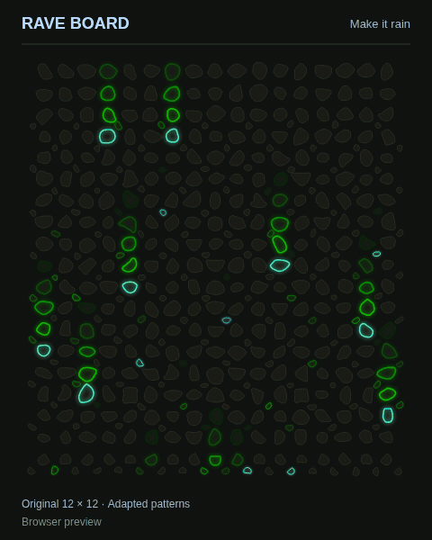

# Rave Board

Light shows for Kilter climbing boards, controlled from your browser over Bluetooth.

**[Try the live app](https://raveboard.up.railway.app/rave)** · [Setup guide](docs/using-rave-board.md) · [How it works](docs/architecture.md) · [Contributing](CONTRIBUTING.md)

<p align="center"></p>

*Rendered browser preview. Physical board updates depend on the controller and Bluetooth connection; this is not a recording of hardware performance.*

Rave Board started at Gravity Lab in Durango, Colorado: what else could a climbing wall's LEDs do between climbing sessions? It now has 13 effects, a scrolling message, a green climber who falls into a ground-up burst, and a preview that uses the individual hold shapes.

## What you can do

- Play rain, lasers, fireworks, colorful fields, lettering, or an automatic cycle.
- Compare **Original** patterns with **Adapted** versions that give large bolt-ons and small screw-ons different roles.
- Preview traced hold shapes or simple dots. Previewing needs no board.
- Adjust motion from **0.1× to 32×** and brightness from **35% to 100%**.
- Use pinned animation and pattern-version controls on mobile.
- Connect directly to a board, check the corner mapping, play, stop and clear, or disconnect immediately.

Kilter Original has six layouts with adapted patterns and hold-shape data. Homewall has ten layouts using the original patterns and dot preview. The default is Original 12×12 with kickboard, with 476 mapped holds.

## Run it locally

Requires **Node.js 24 or newer**. There are no npm dependencies, API keys, accounts, or database to configure.

```sh
git clone https://github.com/sleechie/rave-board.git
cd rave-board
npm start
```

Open **http://localhost:8080**. To check the software:

```sh
npm test
```

The app also runs from the included Dockerfile. Set `PORT` if you need a different port. [Deployment details](docs/development.md#deployment).

## Connect a board

Get the gym's permission and keep the wall clear while using a light show. Disconnect other apps controlling the board, select its layout and installed holds, then use **Connect board → Test corners → Play on board**. [Full setup and troubleshooting](docs/using-rave-board.md).

| Device/browser | Current behavior |
| --- | --- |
| Chrome or Edge on Windows/macOS | Connection offered when Web Bluetooth is available |
| Chrome on Android | Experimental connection support |
| iPhone/iPad | Preview only in this release |
| Other browsers/platforms | Preview; connection depends on Web Bluetooth availability |

Bluetooth needs HTTPS or localhost. The website server serves files; **your browser sends the lights directly to the board**. Board selection is stored locally in your browser. There is no cloud board control or application analytics.

## Current status

This is an experimental project with software tests and some real-board use, not a tested-everywhere controller.

- Animation playback and scrolling Gravity Lab text have been reported working on an Original board.
- Tests cover both Aurora protocol versions, all bundled layouts, animation output, packet checksums, cancellation, latest-selection behavior, and connection policy.
- The current **Fewer replies** sending mode passes software checks but still needs a physical-board comparison against **Conservative**, especially for Stop latency.
- A gym session reported roughly **1.2 sent frames/sec** for Laser cathedral. That is one observation, not a hardware ceiling. The speed slider advances the animation timeline; it does not raise Bluetooth throughput.
- Hold outlines are traced from artwork. Glow is approximate; 51 missing outlines on the 12×14 layout use labeled fallback rings.

See [validation and known limits](docs/validation.md) for what is established and what still needs testing.

## Inside the project

Plain browser JavaScript and Canvas, a small Node HTTP server, and Node's built-in test runner. No frontend framework or build step.

| Area | Files |
| --- | --- |
| Effects and hold-aware patterns | [`site/effects.mjs`](site/effects.mjs), [`site/patterns.mjs`](site/patterns.mjs), [`site/climber.mjs`](site/climber.mjs) |
| Bluetooth framing and playback | [`site/protocol.mjs`](site/protocol.mjs) |
| Traced hold preview | [`site/hold-shapes.mjs`](site/hold-shapes.mjs), [`site/hold-view.mjs`](site/hold-view.mjs) |
| Browser controls | [`site/app.mjs`](site/app.mjs) |
| Static hosting | [`server.mjs`](server.mjs), [`Dockerfile`](Dockerfile) |
| Verification | [`test/`](test/) |

The interesting engineering work is in keeping input responsive while sending a low-resolution display over a slow connection. [The architecture notes](docs/architecture.md) explain the tradeoff between throughput, acknowledgements, and cancellation.

## Contribute

Bug reports with a reproducible example are useful even if you do not have a board. Contributions to accessibility, animation readability, device compatibility, and documented hardware testing are welcome. Start with [CONTRIBUTING.md](CONTRIBUTING.md).

The `experiment/hold-sizes` branch holds the separate comparison lab. It is an experiment with a frozen sender, not the current production implementation.

## License and credits

Original Rave Board code and documentation are available under the **[MIT License](LICENSE)**. Third-party data and artwork retain their own terms; see [NOTICE.md](NOTICE.md).

- [Grip Connect](https://github.com/Stevie-Ray/hangtime-grip-connect): board maps and Aurora protocol references.
- [Boardsesh](https://github.com/boardsesh/boardsesh): traced hold geometry and protocol research.
- [Off The Wall](https://thurley.com/offthewall/): another independent board-animation project; comparing its public sender informed our reply-policy experiment.

Built by [Braden / sleechie](https://github.com/sleechie). Independent of Kilter, Aurora Climbing, and Gravity Lab.
