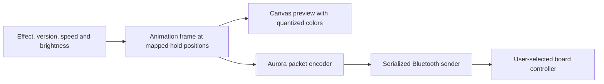

# How Rave Board works

The board behaves like a small, irregular display. The browser computes a picture, maps each colored point to an LED address, and sends that picture over Bluetooth. The web server only hosts the files.

## Geometry and animation

`boards.json` contains LED address, position and hold-set information for six Original and ten Homewall layouts. There is no automatic hardware-to-layout discovery: the user selects the physical layout and installed sets.

`effects.mjs` provides the original effects. `patterns.mjs` adds Original hold roles and the adapted designs. `climber.mjs` contains the repeating climb, hang, fall, burst and embers sequence. The frame shape is a list of `{position, rgb}` records, independent of the preview renderer and Bluetooth transport.

The motion slider advances animation time. It does not change radio capacity. A 32-second scene at 10× progresses through its timeline in roughly 3.2 seconds, but a slow link can show only a few pictures from that scene.

## Hold-shape preview

`hold-shapes.mjs` checks a shape asset against the selected board before mapping its polygons to normalized coordinates. Every polygon must match its LED address, location and hold set. `hold-view.mjs` caches Canvas paths and renders each selected hold with that frame's color.

The default 12×12-with-kickboard layout has 476 outlines. The 12×14 source has 51 missing outlines, displayed as approximate rings with a visible note. Homewall keeps its dot preview; its Auxiliary sets are not treated as Original footholds.

Shapes, glow and perspective are a preview, not a physical-light calibration. Switching the preview style does not change transmitted colors.

## Sending and cancellation

`protocol.mjs` implements Aurora API 2 and API 3 replacement frames. API 2 packs a 10-bit LED address and 2/2/2-bit color into two bytes; API 3 uses a 16-bit address and 3/3/2-bit color in three bytes. Packet checksums and first/middle/last/only markers are checked independently in the tests.

The sender uses 20-byte BLE writes as a compatibility choice. This is not a claim that all controllers have a universal 20-byte maximum. Packet bodies are limited to 55 bytes, keeping each complete packet at most 60 bytes.

There is one application frame in flight. A speed/effect change invalidates the old request; an unfinished packet is completed, then obsolete work is dropped. A subsequent FIRST or ONLY packet starts the next image. Stop follows the same boundary rule and sends an empty ONLY frame. Immediate disconnect closes the transport even during a stalled write.

Two reply policies are available:

| Policy | Behavior |
| --- | --- |
| Fewer replies | On API 3 controllers exposing both modern write methods, request a response at the end of the complete image. Clear commands still request a response. |
| Conservative | Request a response at each short packet ending when supported, as the earlier sender did. |

API 2, write-only and legacy clients retain their previous behavior. No-response-only clients continue using no-response writes. Every write is awaited; no application-level backlog of animation frames is built.

Fewer intermediate responses can reduce waiting, but may allow more buffering in the operating system or controller. It is a throughput/latency tradeoff to measure on real hardware. A GATT write response confirms a write operation, not visible LED application. The connected preview shows the last frame whose writes completed.

## Browser and server boundaries

The page requests a device from a user click, then writes directly through Web Bluetooth. Hiding the page while playing attempts to stop and clear; losing the connection can leave the last frame lit. The current release intentionally offers preview only on iPhone/iPad.

`server.mjs` is a zero-dependency Node static server with an explicit page/asset allowlist, `/healthz`, correct content types and shutdown handling. Repository docs, dotfiles and source archives are not served. There is no backend animation process, database, account system or board telemetry.

## Verification

See [validation.md](validation.md). Software tests establish encoded bytes, scheduling behavior and data consistency. They cannot establish physical refresh rate or visible Stop latency.
